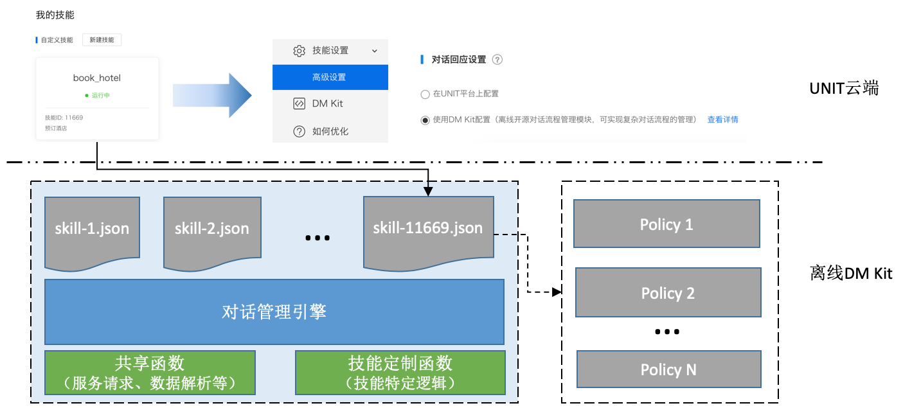

# DM Kit 快速上手

## 简介

在任务型对话系统（Task-Oriented Dialogue System）中，一般包括了以下几个模块：

* Automatic Speech Recognition（ASR），即语音识别模块，将音频转化为文本输入。
* Natural Language Understanding（NLU），即自然语言理解模块，通过分析文本输入，解析得到对话意图与槽位（Intent + Slots）。
* Dialog Manager（DM），即对话管理模块，根据NLU模块分析得到的意图+槽位值，结合当前对话状态，执行对应的动作并返回结果。其中执行的动作可能涉及到对内部或外部知识库的查询。
* Natural Language Generation（NLG），即自然语言生成。目前一般采用模板的形式。
* Text To Speech（TTS），即文字转语音模块，将对话系统的文本输出转化为音频。

DM Kit关注其中的对话管理模块（Dialog Manager），解决对话系统中状态管理、对话逻辑处理等问题。在实际应用中，单个垂类下对话逻辑一般都是根据NLU结果中意图与槽位值，结合当前对话状态，确定需要进行处理的子流程。子流程或者返回固定话术结果，或者根据NLU中槽位值与对话状态访问内部或外部知识库获取资源数据并生成话术结果返回，在返回结果的同时也对对话状态进行更新。我们将这部分对话处理逻辑进行抽象，提供一个通过配置快速构建对话流程，可复用的对话管理模块，即Reusable Dialog Manager。

## 架构

如上图所示，系统核心是一个对话管理引擎，在对话管理引擎的基础上，每个垂类bot的实现都是通过一个配置文件来对对话逻辑和流程进行描述，这样每个垂类仅需要关注自身对话逻辑，不需要重复开发框架代码。一个垂类的配置包括了一系列的policy，每个policy包括三部分：触发条件（trigger），参数变量（params），以及输出（output）。

* 触发条件（trigger）包括了NLU解析得到的意图+槽位值，以及当前的对话状态，限定了该policy被触发的条件；

* 参数变量（params）是该policy运行需要的一些数据变量的定义，可以包括NLU解析结果中的槽位值、session中的变量值以及函数运行结果等。这里的函数需要在系统中进行注册，例如发送网络请求获取数据这样的函数，这些通用的函数在各个垂类间都能共享，特殊情况下个别垂类会需要定制化注册自己的函数；

* 输出结果（output）即为该policy运行返回作为对话系统的结果，可以包括话术tts及指令，同时还可对对话状态进行更新以及写入session变量。这里的结果可以使用已定义的参数变量进行模板填充。

在垂类基础配置之上，还衍生出了一系列扩展功能。例如我们对一些仅需要触发条件及输出的垂类，我们可以设计更精简的语法，使用更简洁的配置描述对话policy；对于多状态跳转的场景，我们引入了可视化的编辑工具，来描述对话跳转逻辑。精简语法表示及可视化编辑都可以自动转化为对话管理引擎可执行的配置，在系统中运行。

## 使用DM Kit搭建BOT的一般步骤

DM Kit依托UNIT提供的自然语言理解能力，在此基础上搭建对话BOT的一般步骤为：

* 通过UNIT平台创建BOT，配置BOT对话流程所需的意图解析能力；

* 编写BOT的policy配置，policy配置文件语法见[垂类配置](#垂类配置)。对于对话状态状态繁多，跳转复杂的BOT，可以借助[可视化配置工具](visual_tool.md)进行可视化编辑并导出垂类配置。

* 将UNIT平台所创建BOT的id与其对应policy配置文件注册于DM Kit全局垂类注册文件，注册文件配置项见[垂类注册](#垂类注册)。完成之后编译运行DM Kit主程序，访问DM Kit[服务接口](#服务接口)即可测试对话效果。

## 详细配置说明

本节详细介绍实现垂类功能的配置语法。所有垂类的配置均位于模块源码conf/app/目录下。

### 垂类注册

products.json为全局垂类注册配置文件，默认采用以"default"为key的配置项，该配置项中每个垂类已botid为key，注册添加垂类详细配置，配置字段解释如下：

| 字段             |含义                         |
|-----------------|-----------------------------|
|conf_path        |垂类policy配置文件地址          |
|score            |垂类排序静态分数，可设置为固定值1  |

### 垂类配置

单个垂类配置文件包括了一系列policy，每个policy字段说明如下：

| 字段                             | 类型         |说明                            |
|---------------------------------|--------------|-------------------------------|
|trigger                          |object        | 触发节点，如果一个query满足多个policy的触发条件，则优先取status匹配的policy，再根据slot取覆盖个数最多的 |
|+intent                          |string        | 触发所需NLU意图，意图由UNIT云端对话理解获得。此外，DM Kit定义了以下预留意图： dmkit_intent_fallback： 当云端返回意图在DM Kit配置中未找到匹配policy时，DM Kit将尝试使用该意图触发policy |
|+slot                            |list          | 触发所需槽位值列表|
|+state                           |string        | 触发所需状态值，即上一轮对话session中保存的state字段值 |
|params                           |list          | 变量列表 |
|+params[].name                   |string        | 变量名，后定义的变量可以使用已定义的变量进行模板填充，result节点中的值也可以使用变量进行模板填充。变量的使用格式为 |
|+params[].type                   |string        | 变量类型，可能的类型为slot_val,request_param,session_context,func_val等，详细类型列表及说明可参照[params类型及说明](#params中变量类型列表及其说明) |
|+params[].value                  |string        | 变量定义值 |
|+params[].required               |bool          | 是否必须，如果必须的变量为空值时，该policy将不会返回结果 |
|output                           |list          | 返回结果节点，可定义多个output，最终输出会按顺序选择第一个满足assertion条件的output |
|+output[].assertion              |list          | 使用该output的前提条件列表 |
|+output[].assertion[].type       |string        | 条件类型，详细列表及说明可参照[assertion类型及说明](#result中assertion类型说明) |
|+output[].assertion[].value      |string        | 条件值 |
|+output[].session                |object        | 需要保存的session数据，用于更新对话状态及记录上下文 |
|+output[].session.state          |string        | 更新的对话状态值 |
|+output[].session.context        |kvdict        | 写入session的变量节点，该节点下的key+value数据会存入session，再下一轮中可以在变量定义中使用 |
|+output[].result                 |list          | 返回结果中result节点，多个result作为数组元素一起返回 |
|+output[].result[].type          |string        | result类型 |
|+output[].result[].value         |string        | result值            |

#### params中变量类型列表及其说明：

| type     |说明           |
|----------|--------------|
| slot_val | 从qu结果中取对应的slot值，有归一化值优先取归一化值。当对应tag值存在多个slot时，value值支持tag后按分隔符","添加下标i取对应tag的第i个值（索引从0开始） |
| request_param | 取请求参数对应的字段 |
| session_context | 上一轮对话session结果中context结构体中对应的字段，例如上一轮output中context结构体保存了变量： "context": {"param_name": ""}， 本轮可定义变量{"name": "param_name", "type": "session_context", "value": "param_name"} |
| func_val | 调用开发者定义的函数。用户定义函数位于src/user_function目录下，并需要在user_function_manager.cpp文件中进行注册。value值为","连接的参数，其中第一个元素为函数名，第二个元素开始为函数参数 |
| qu_intent | NLU结果中的intent值 |
| session_state | 当前对话session中的state值 |
| string | 字符串值，可以使用已定义变量进行模板填充 |

特别的，开发者可以添加注册自定义函数，定义func_val类型的变量调用自定义函数实现功能扩展、定制化对话逻辑。DM Kit默认内置提供了包括以下函数：

| 函数名          |函数说明              | 参数  |
|----------------|--------------|----------------------|
| service_http_get                   | 通过HTTP GET的方式请求知识库、第三方API等服务，服务地址需配置于conf/app/remote_services.json中     |参数1：remote_services.json中配置的服务名  参数2：服务请求的路径，例如"/baidu/unit-dmkit"    |
| service_http_post                  | 通过HTTP POST的方式请求知识库、第三方API等服务，服务地址需配置于conf/app/remote_services.json中。注意：如果请求路径包含中文，需要先对中文进行URL编码后再拼接URL     |参数1：remote_services.json中配置的服务名  参数2：服务请求的路径，例如"/baidu/unit-dmkit"  参数3：POST数据内容   |
| json_get_value                     | 根据提供的路径从json字符串中获取对应的字段值       |参数1：json字符串  参数2：所需获取的字段在json字符串中的路径。例如{"data":{"str":"hello", "arr":[{"str": "world"}]}}中路径data.str对应字段值为"hello", 路径data.arr.0.str对应字段值"world"。|
| url_encode                         | 对输入字符串进行url编码操作       |参数1：进行编码的字符串|

另外，DM Kit默认定义提供以下变量：

| 变量名                           | 说明                                                                      |
|---------------------------------|--------------------------------------------------------------------------|
| dmkit_param_last_tts            | 上一轮返回结果result中第一个type为tts的元素value值，如果不存在则为空字符串         |
| dmkit_param_context_xxxxx       | 上一轮session结果context中key为xxxx的值，同时如果用户定义了名为dmkit_param_context_xxxxx的变量，dmkit自动将该变量以xxxxx为key存入本轮session结果context|
| dmkit_param_slot_xxxxx          | qu结果中tag为xxxxx的slot值, 如果存在多个相同tag的slot，则取第一个|

#### result中assertion类型说明：

| type     |说明           |
|----------|--------------|
| empty  | value值非空  |
| not_empty  | value值为空  |
| in  | value值以","切分，第一个元素在从第二个元素开始的列表中  |
| not_in | value值以","切分，第一个元素不在从第二个元素开始的列表中  |
| eq |  value值以","切分，第一个元素等于第二个元素 |
| gt  | value值以","切分，第一个数字大于第二个数字  |
| ge | value值以","切分，第一个数字大于等于第二个数字  |

### 精简语法及可视化配置

* 在默认基础配置之上，有能力的开发者可以自行设计使用更简洁的配置描述对话policy并转化为基础配置进行加载。
* 对于多状态跳转的场景，可以引入了可视化的编辑工具，来描述对话跳转逻辑。这里我们提供了一个使用[mxgraph](https://github.com/jgraph/mxgraph)进行可视化配置的样例，文档参考：[可视化配置工具](visual_tool.md)

## DM Kit服务接口

* DM Kit服务监听端口及访问路径等参数可通过conf/gflags.conf文件进行配置，默认请求链接为http://<HOST>:8010/search, 其中<HOST>为DM Kit服务所在机器IP，请求方式为POST
* 服务接收POST数据协议与[UNIT2.0接口协议](http://ai.baidu.com/docs#/UNIT-v2-API/top)兼容。开发者按照协议组装JSON数据请求DM Kit，DM Kit按照该协议返回JSON数据，同时DM Kit定义返回结果action_list中custom_reply类型为DM_RESULT时，返回内容为DM Kit输出的output结果。
